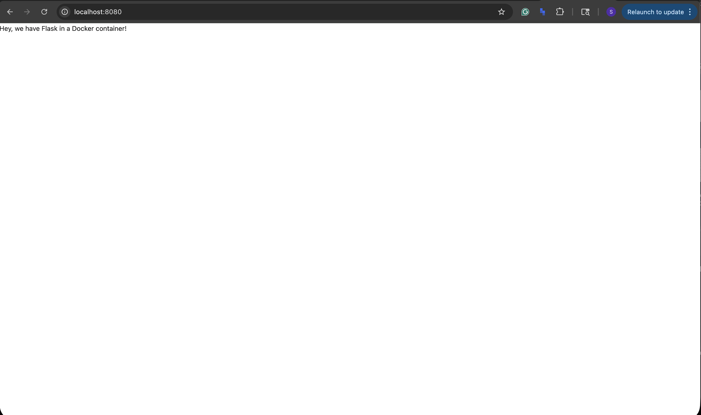

# Dockerized Flask App

This project containerizes a simple Flask web application using Docker.
The app runs on a remote server and is viewed locally using SSH port forwarding.

First I recreated the tutorial files and fixed errors in the archived instructions.
Then I built a Docker image and mapped the container port to my user id port so it would not conflict with other students.
Finally I forwarded the port to my laptop browser to view the webpage.

## Screenshot

